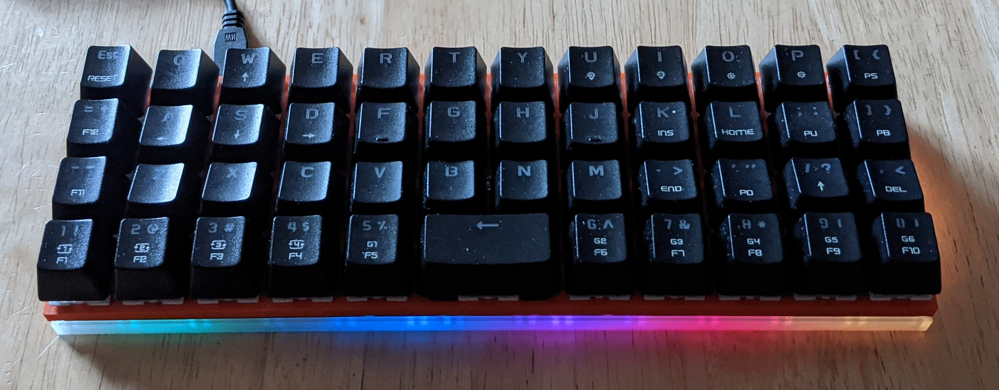

# jj40

[jj40](https://kprepublic.com/collections/daisy-40/products/jj40-v1-5-40-custom-keyboard-pcb-similar-with-planck) sandwich case based on [sleeping-h/jj40-compact-case](https://github.com/sleeping-h/jj40-compact-case).
Mostly redone from scratch for 2u spacebar but reused the lower cutouts.
Salvaged a used [Motospeed CK61](http://www.motospeed.cc/index.php?ac=article&at=read&did=500) for parts (good keyboard with bad layer switch out-of-the-box so they can be gotten pretty cheap).



## TODO

Holes of the top plate turned out a bit too small for my screws and i had to drill them a bit larger, so these need some adjustment.

# Steps done

Used `planck` preset from [keyboard-layout-editor](http://www.keyboard-layout-editor.com/#/) with:
```json
[{a:7},"Tab","Q","W","E","R","T","Y","U","I","O","P","Back Space"],
["Esc","A","S","D","F","G","H","J","K","L",";","'"],
["Shift","Z","X","C","V","B","N","M",",",".","/","Return"],
["","Ctrl","Alt","Super","&dArr;",{w:2},"","&uArr;","&larr;","&darr;","&uarr;","&rarr;"]
```

Created svg using [swillkb](http://builder.swillkb.com/):
- switch type `MX {_t:1}`
- stabilizer `Cherry Only {_s:2}`

Rotated and aligned spacebar cutout so that stabilizer is faced to top end and added holes.
